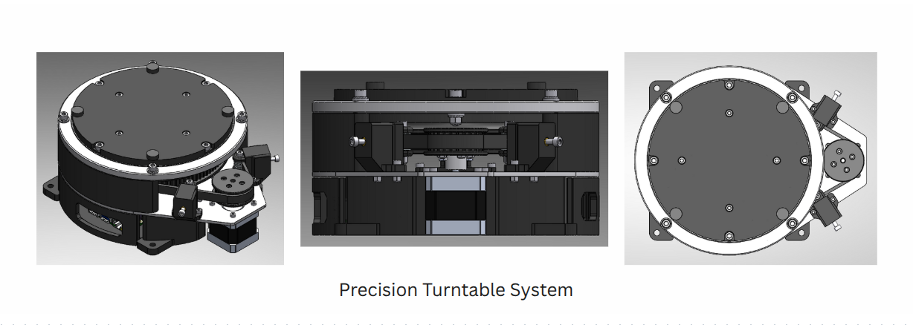
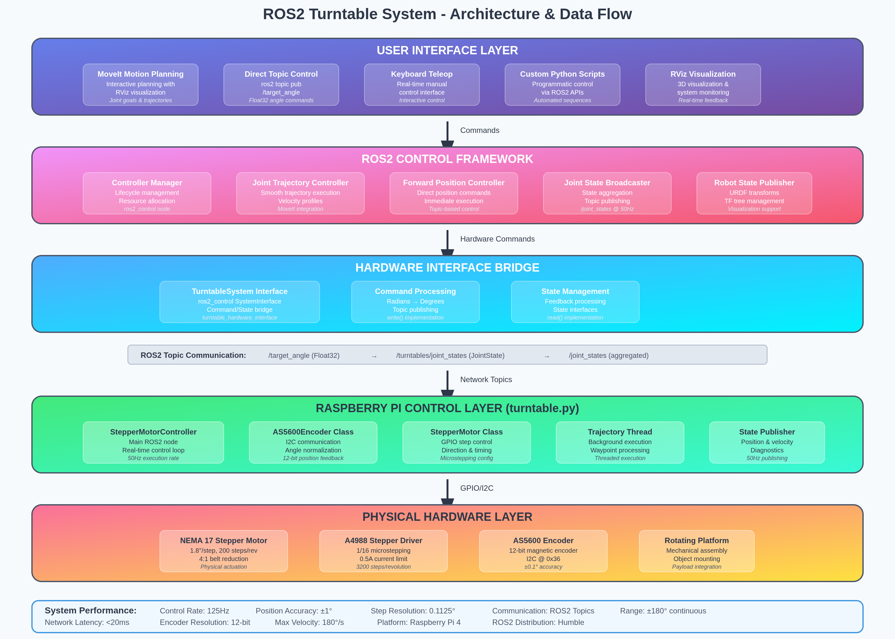
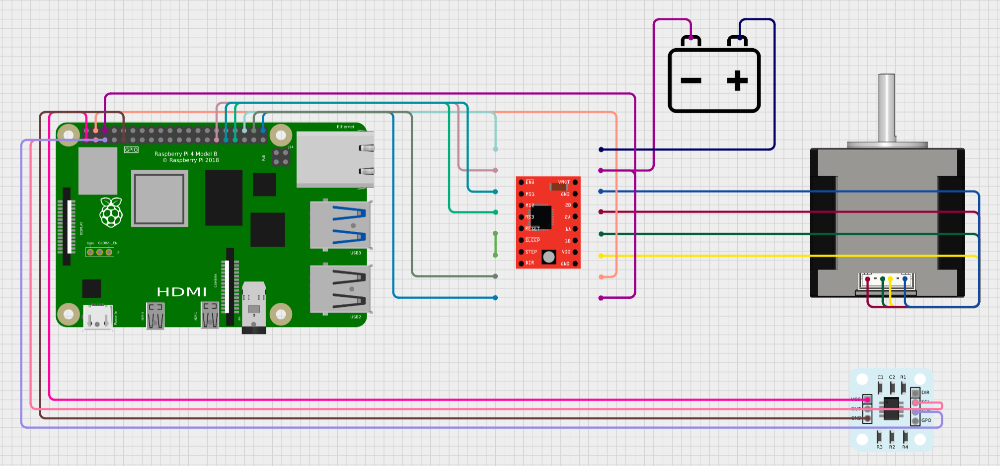
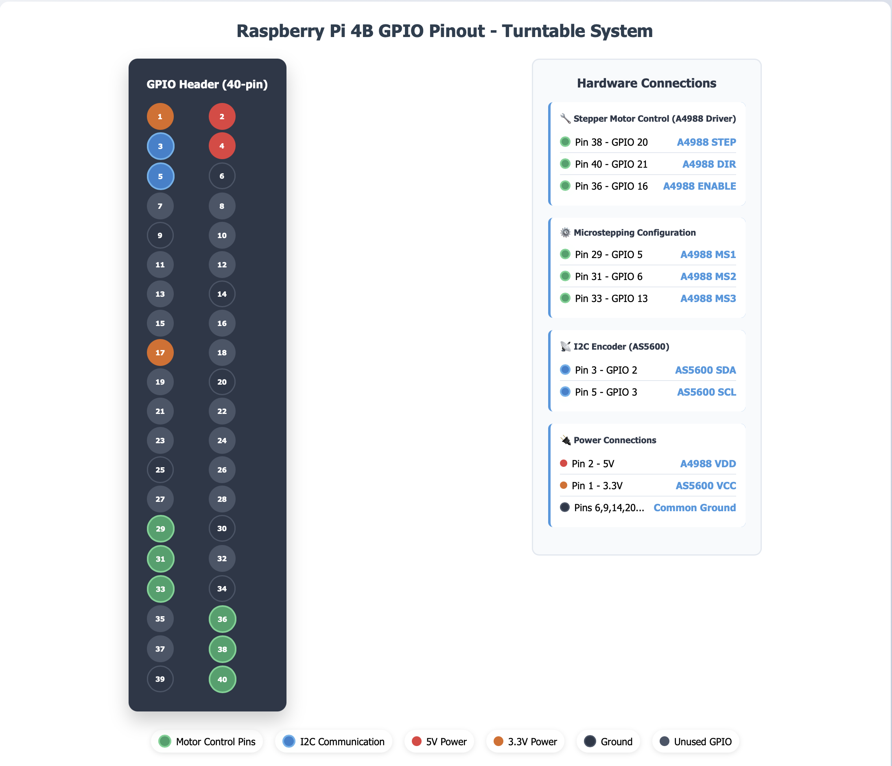
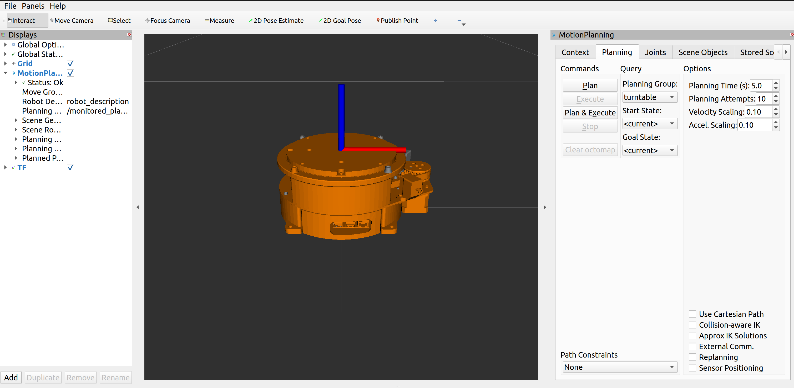

# ROS2-Humble Turntable System with Precision Stepper Control
  

🎯 Overview
This comprehensive ROS2 integration suite transforms standalone precision turntable systems into fully autonomous robotic platforms through seamless hardware-software integration. The system bridges low-level stepper motor control and AS5600 magnetic encoder feedback with high-level motion planning capabilities, providing complete URDF modeling, standardized hardware interfaces, and MoveIt integration for advanced trajectory planning and execution. By combining precise rotational control of the disc platform with ROS2's robust control framework, this solution enables sophisticated autonomous operation with professional-grade planning and control features, making custom turntable systems accessible to the broader robotics ecosystem while maintaining the precision and reliability required for demanding applications.

## Key Features



Precision Control: Sub-degree positioning accuracy with magnetic encoder feedback
ROS2 Integration: Full ros2_control framework implementation
MoveIt Compatibility: Complete motion planning and trajectory execution
Hardware Abstraction: Seamless switching between simulation and real hardware
Real-time Feedback: Continuous position and velocity monitoring
Robust Communication: Reliable ROS2 topic-based hardware interface

**Key Features:**
- ⚡ **Sub-degree precision** with magnetic encoder feedback
- 🔧 **Dual controller architecture** supporting both trajectory and direct position control
- 🌐 **Full ROS2 integration** with ros2_control framework and MoveIt
- 📡 **Real-time communication** via ROS2 topics at 125Hz
- 🎮 **Multiple control interfaces** including MoveIt planning, direct topics, and keyboard control
- 🔄 **Hardware abstraction** enabling seamless simulation and real hardware switching


## 📥 Getting Started

### Clone the Repository

```bash
# Clone the repository
git clone https://github.com/your-username/turntable-ros2-driver.git
cd turntable-ros2-driver

# Initialize workspace
mkdir -p ~/turntable_ws/src
cp -r * ~/turntable_ws/src/
cd ~/turntable_ws
```

## 🏗️ System Architecture



The system follows a layered architecture approach:

1. **User Interface Layer** - MoveIt planning, RViz visualization, keyboard/topic control
2. **ROS2 Control Layer** - Joint trajectory controller, forward position controller
3. **Hardware Interface Bridge** - Custom ros2_control SystemInterface implementation
4. **Raspberry Pi Layer** - Real-time motor control and encoder feedback
5. **Physical Hardware Layer** - NEMA 17 motor, A4988 driver, AS5600 encoder

### Data Flow

```
User Command → ROS2 Controllers → Hardware Interface → /target_angle topic 
→ Raspberry Pi → Motor Control → Physical Movement → Encoder Reading 
→ /joint_states topic → Hardware Interface → ROS2 Control Framework
```

## 🎮 Control System Design

### 1. Joint Trajectory Controller

**Control Law:**
```python
# Position + Velocity Feedforward Control
error(t) = (θ_target - θ_current + π) mod 2π - π
step_direction = sign(error)
step_delay = f(ω_target)  # Velocity feedforward
while |error| > tolerance:
    execute_step(step_direction)
```

**Features:**
- Smooth motion profiles with velocity control
- MoveIt integration for advanced planning
- Trajectory waypoint execution with timing
- Velocity feedforward for smooth acceleration

### 2. Forward Position Controller

**Control Law:**
```python
# Bang-Bang Position Control
error = (θ_target - θ_current + 180) mod 360 - 180
if |error| > deadband:
    step_direction = 1 if error > 0 else -1
    execute_step(step_direction)
```

**Features:**
- Direct position commands via ROS2 topics
- Fast response for immediate positioning
- Compatible with keyboard teleop and custom control nodes
- Simple implementation for real-time control

### 3. Supported Control Interfaces

| Interface | Controller Used | Use Case | Input Type |
|-----------|----------------|----------|------------|
| **MoveIt Planning** | Joint Trajectory | Automated motion planning | `JointTrajectory` |
| **Direct Topics** | Forward Position | Manual/programmatic control | `Float32` angle |
| **Keyboard Teleop** | Forward Position | Real-time manual control | Keyboard input |

## 🔌 Hardware Configuration

### Complete Hardware Wiring



### Raspberry Pi 4B Pinout



#### Pin Assignments

| Function | Raspberry Pi Pin | GPIO | Connection | Description |
|----------|-----------------|------|------------|-------------|
| **Motor Control** | | | | |
| Step Pulse | Pin 38 | GPIO 20 | → A4988 STEP | Step pulse generation |
| Direction | Pin 40 | GPIO 21 | → A4988 DIR | Rotation direction control |
| Enable | Pin 36 | GPIO 16 | → A4988 ENABLE | Motor enable/disable |
| **Microstepping** | | | | |
| MS1 | Pin 29 | GPIO 5 | → A4988 MS1 | Microstepping bit 1 |
| MS2 | Pin 31 | GPIO 6 | → A4988 MS2 | Microstepping bit 2 |
| MS3 | Pin 33 | GPIO 13 | → A4988 MS3 | Microstepping bit 3 |
| **Encoder (I2C)** | | | | |
| Data Line | Pin 3 | GPIO 2 (SDA) | → AS5600 SDA | I2C data communication |
| Clock Line | Pin 5 | GPIO 3 (SCL) | → AS5600 SCL | I2C clock signal |
| **Power** | | | | |
| 5V Logic | Pin 2 | 5V | → A4988 VDD | Driver logic power |
| 3.3V Sensor | Pin 1 | 3.3V | → AS5600 VCC | Encoder power supply |
| Ground | Pins 6,9,14... | GND | → Common GND | System ground reference |

### A4988 Stepper Driver Configuration

#### Current Limit Settings

**Recommended Vref: 0.40V - 0.50V**

```
Current Limit Calculation:
Vref = 0.45V (example setting)
Current Limit = Vref / (8 × Rs)
Where Rs = 0.1Ω (typical sense resistor)
Current Limit = 0.45V / 0.8Ω = 0.5625A
```

**Microstepping Configuration:**
- MS1 = HIGH, MS2 = HIGH, MS3 = HIGH
- Result: 1/16 microstepping
- Resolution: 3200 steps/revolution
- Step angle: 0.1125° per step

### AS5600 Magnetic Encoder

**Specifications:**
- **Resolution:** 12-bit (4096 positions per revolution)
- **Accuracy:** ±0.1° typical
- **Interface:** I2C at address 0x36
- **Update Rate:** Up to 500Hz (limited to 50Hz in software)
- **Magnet Requirements:** Diametric magnetized, 200-400 Gauss

## 🔧 ROS2 Humble Integration

### Package Structure

```
turntable_ws/src/
├── turntable_description/              # Robot URDF and visualization
│   ├── urdf/                           # Robot description files
│   ├── meshes/                         # 3D models for visualization
│   ├── config/                         # Joint limits, kinematics
│   └── launch/                         # Launch files
├── turntable_hardware_interface/       # ros2_control hardware interface
│   ├── src/turntable_system.cpp        # Hardware interface implementation
│   ├── include/turntable_system.hpp    # Header files
│   └── config/                         # Hardware parameters
├── turntable_moveit_config/            # MoveIt motion planning
│   ├── config/                         # MoveIt configuration
│   └── launch/                         # MoveIt launch files
└── turntable.py                        # Raspberry Pi control node
```

### ROS2 Control Framework Integration


The system implements a custom `hardware_interface::SystemInterface` that bridges ROS2 control commands with the physical hardware via ROS2 topics.

**Key Components:**
- **TurntableSystem**: Custom hardware interface for ros2_control
- **Topic-based Communication**: Network-transparent hardware control
- **State Management**: Real-time position and velocity feedback
- **Controller Support**: Both trajectory and position controllers

## 💻 Installation and Dependencies

### 1. Host System Setup (Ubuntu 22.04 + ROS2 Humble)

### 2. Raspberry Pi Setup

```bash
# Enable I2C and GPIO
sudo raspi-config
# Navigate to: Interface Options > I2C > Enable
# Navigate to: Interface Options > GPIO > Enable

# Install system packages
sudo apt update
sudo apt install -y \
    python3-pip \
    python3-dev \
    i2c-tools \
    git

# Install Python dependencies
pip3 install \
    RPi.GPIO \
    smbus \
    rclpy \
    std_msgs \
    sensor_msgs \
    trajectory_msgs \
    diagnostic_msgs

# Optional: Install ROS2 Humble on Raspberry Pi
sudo apt install ros-humble-ros-base

# Test I2C connection
i2cdetect -y 1
# Should show device at address 0x36 (AS5600)

# Set permissions
sudo usermod -a -G gpio $USER
sudo usermod -a -G i2c $USER
sudo reboot
```

### Workspace Build

```bash
# Create workspace
mkdir -p ~/turntable_ws/src
cd ~/turntable_ws/src

# Clone repository
git clone https://github.com/DevanshB99/Turntable_ROS2_Driver.git .

# Install dependencies
cd ~/turntable_ws

# Build packages
colcon build

# Source workspace
source ~/turntable_ws/install/setup.bash
```

## 🚀 System Launch Procedure

### Step 1: Hardware Verification

**On Raspberry Pi:**

```bash
# Test I2C encoder connection
python3 -c "
import smbus
bus = smbus.SMBus(1)
try:
    data = bus.read_i2c_block_data(0x36, 0x0C, 2)
    angle = ((data[0] << 8) | data[1]) * (360.0 / 4096.0)
    print(f'✓ Encoder angle: {angle:.2f}°')
except Exception as e:
    print(f'✗ Encoder error: {e}')
"

# Test GPIO access
python3 -c "
import RPi.GPIO as GPIO
GPIO.setmode(GPIO.BCM)
GPIO.setup(20, GPIO.OUT)
print('✓ GPIO access working')
GPIO.cleanup()
"
```

### Step 2: Launch Raspberry Pi Controller

**Terminal 1 (Raspberry Pi):**

```bash
cd ~/turntable_ws/src
python3 turntable.py
```

**Expected Output:**
```
[INFO] [stepper_motor_controller]: Stepper Motor Controller Initialized
[INFO] [stepper_motor_controller]: Encoder initialized. Initial position: 45.23°
[INFO] [stepper_motor_controller]: Microstepping set to 1/16
[INFO] [stepper_motor_controller]: ✓ Magnet detected by encoder
```

### Step 3: Launch Host System

#### Option A: Simulation Mode

**Terminal 2 (Host System):**

```bash
cd ~/turntable_ws
source install/setup.bash
ros2 launch turntable_description turntable_sim.launch.py
```

#### Option B: Hardware Mode

**Terminal 2 (Host System):**

```bash
cd ~/turntable_ws
source install/setup.bash
ros2 launch turntable_description turntable_hw.launch.py
```

### Step 4: System Verification

**Terminal 3:**

```bash
# Check all nodes are running
ros2 node list

# Verify controllers are loaded
ros2 control list_controllers

# Test direct position control
ros2 topic pub /target_angle std_msgs/msg/Float32 "{data: 90.0}" --once


```

**Expected Output:**
```
/controller_manager
/robot_state_publisher
/move_group
/rviz2
/stepper_motor_controller

turntable_trajectory_controller[joint_trajectory_controller/JointTrajectoryController]: active
joint_state_broadcaster[joint_state_broadcaster/JointStateBroadcaster]: active

```

### Step 5: MoveIt Operation



**In RViz:**
1. **Set Planning Group:** Select "turntable" in MoveIt panel
2. **Set Goal:** Use interactive marker or enter target angle
3. **Plan:** Click "Plan" to generate trajectory
4. **Execute:** Click "Execute" to run planned motion

**Example MoveIt Commands:**

```bash
# Plan and execute to 45 degrees
ros2 action send_goal /turntable_trajectory_controller/follow_joint_trajectory \
control_msgs/action/FollowJointTrajectory \
"{trajectory: {joint_names: ['disc_joint'], points: [{positions: [0.785], time_from_start: {sec: 3}}]}}"
```

## 🎮 Control Examples

### Direct Topic Control

```bash
# Move to specific angles
ros2 topic pub /target_angle std_msgs/msg/Float32 "{data: 0.0}"     # Home position
ros2 topic pub /target_angle std_msgs/msg/Float32 "{data: 90.0}"    # 90 degrees
```

## 🔍 Troubleshooting

### Common Issues and Solutions

#### Hardware Connection Issues

**Problem:** No encoder readings
```bash
# Check I2C connection
i2cdetect -y 1
# Should show device at 0x36

# If not detected:
sudo raspi-config  # Enable I2C
sudo reboot
```

**Problem:** Motor not moving
```bash
# Check GPIO permissions
ls -l /dev/gpiomem
# Should be accessible to current user

# Check A4988 wiring and Vref setting
# Measure Vref with multimeter: should be 0.40-0.50V
```

#### ROS2 Communication Issues

**Problem:** No joint states published
```bash
# Check if Raspberry Pi node is running
ros2 node list | grep stepper

# Check topic communication
ros2 topic list | grep turntable
ros2 topic echo /turntables/joint_states
```

## 📚 API Reference

### ROS2 Topics

| Topic Name | Message Type | Direction | Description |
|------------|-------------|-----------|-------------|
| `/target_angle` | `std_msgs/Float32` | Input | Direct angle commands (degrees) |
| `/turntables/joint_states` | `sensor_msgs/JointState` | Output | Position and velocity feedback |
| `/diagnostics` | `diagnostic_msgs/DiagnosticArray` | Output | System health and status |

### ROS2 Actions

| Action Name | Action Type | Description |
|-------------|-------------|-------------|
| `/turntable_trajectory_controller/follow_joint_trajectory` | `control_msgs/FollowJointTrajectory` | Execute planned trajectories |

### ROS2 Services

| Service Name | Service Type | Description |
|-------------|-------------|-------------|
| `/controller_manager/list_controllers` | `controller_manager_msgs/ListControllers` | Get controller status |
| `/controller_manager/switch_controller` | `controller_manager_msgs/SwitchController` | Start/stop controllers |

