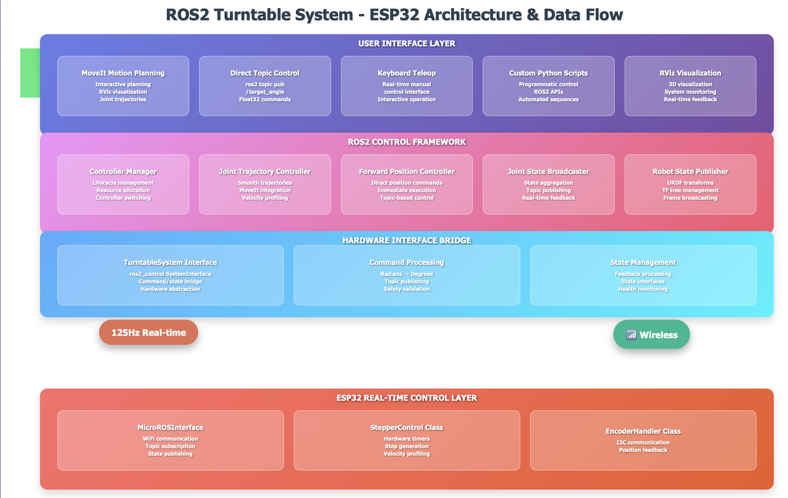
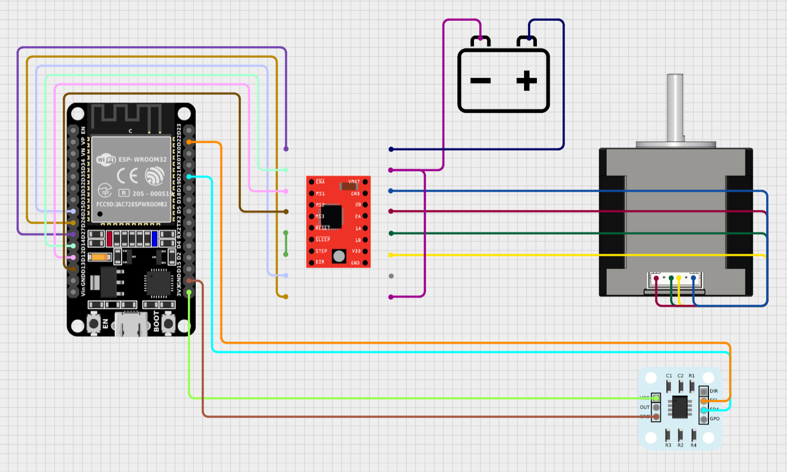
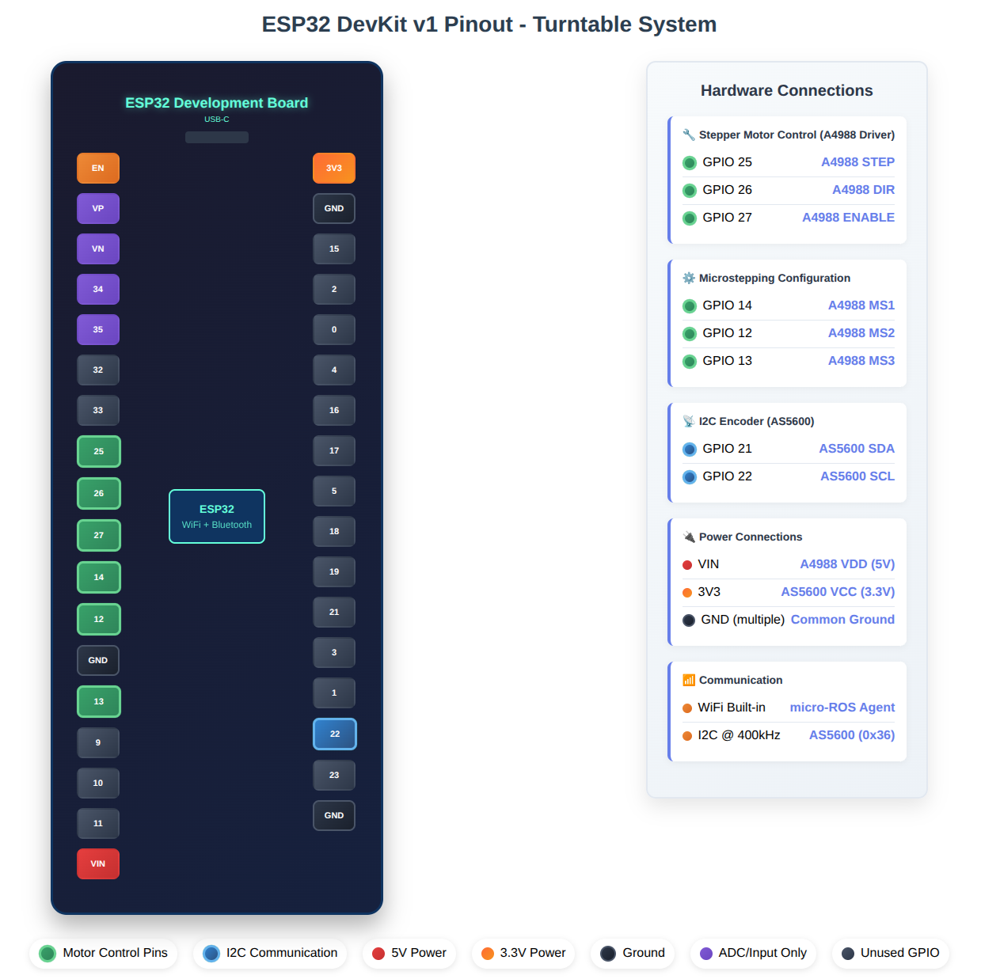

# ROS2-Humble Turntable System with ESP32 Wireless Control
   

## 🎯 Overview

A comprehensive ROS2 integration suite for standalone precision Turntable Systems featuring **ESP32-based wireless control with micro-ROS**. This repository enables complete autonomous operation of custom turntables with advanced planning, wireless communication, and real-time control at 125Hz & implements a cutting-edge robotics turntable system that bridges low-level embedded hardware control with high-level motion planning through wireless communication. The system consists of a rotating disc platform controlled by an ESP32 microcontroller, with precise position feedback from an AS5600 magnetic encoder, all seamlessly integrated with ROS2's control framework via micro-ROS over WiFi for advanced motion planning and visualization.

### Key Features


**🌟 Core Capabilities:**
- **📡 Wireless Control**: Complete elimination of cables through WiFi micro-ROS communication
- **⚡ High-Frequency Operation**: 125Hz control loop and communication for real-time performance
- **🎯 Sub-degree Precision**: 0.087° positioning accuracy with magnetic encoder feedback
- **🔧 Dual Architecture**: Distributed control with ESP32 real-time layer and ROS2 planning layer
- **🌐 Full ROS2 Integration**: Complete ros2_control framework and MoveIt compatibility
- **🔄 Hardware Abstraction**: Seamless switching between simulation and wireless hardware
- **📊 Advanced Diagnostics**: Real-time health monitoring and performance metrics
- **⚙️ Professional Grade**: Industrial-quality control algorithms and safety features

## 📥 Getting Started

### Clone the Repository

```bash
# Clone the ESP32 branch
git clone -b esp32 https://github.com/your-username/turntable-ros2-driver.git
cd turntable-ros2-driver

# Or clone main and switch to ESP32 branch
git clone https://github.com/your-username/turntable-ros2-driver.git
cd turntable-ros2-driver
git checkout esp32

# Initialize workspace
mkdir -p ~/turntable_ws/src
cp -r * ~/turntable_ws/src/
cd ~/turntable_ws
```

## 🏗️ System Architecture & Data Flow




The system follows a distributed wireless architecture approach:

1. **User Interface Layer** - MoveIt planning, RViz visualization, keyboard/topic control
2. **ROS2 Control Framework** - Joint trajectory controller, forward position controller, hardware interface
3. **Hardware Interface** - WiFi communication layer with 125Hz real-time performance
4. **ESP32 Real-time Layer** - Embedded motor control, encoder processing, safety monitoring


```
User Command → ROS2 Controllers → Hardware Interface → micro-ROS WiFi (125Hz)
→ ESP32 Controller → Real-time Motor Control → Physical Movement 
→ Encoder Reading → Position Processing → micro-ROS WiFi (125Hz)
→ Hardware Interface → ROS2 Control Framework → User Feedback
```

## 🎮 Control System Design

### 1. Distributed Control Architecture

**ESP32 Real-time Control Law:**
```cpp
// Position control with velocity profiling
double error = calculateShortestPath(current_pos, target_pos);
if (abs(error) > POSITION_TOLERANCE_DEG) {
    double desired_velocity = error * PROPORTIONAL_GAIN;
    desired_velocity = constrain(desired_velocity, -max_velocity_, max_velocity_);
    setVelocity(desired_velocity);
    updateStepTiming();  // Hardware timer-based step generation
}
```

**ROS2 Host Planning:**
```python
# High-level trajectory planning
trajectory = moveit_planner.plan(start_state, goal_state)
# Sent via micro-ROS WiFi at 125Hz for real-time execution
```

### 2. Joint Trajectory Controller

**Features:**
- **Smooth motion profiles** with real-time velocity control
- **MoveIt integration** for advanced path planning and optimization
- **Multi-point trajectories** with precise timing execution
- **Collision avoidance** and constraint handling
- **Wireless trajectory streaming** at 125Hz

### 3. Forward Position Controller

**Features:**
- **Direct position commands** via ROS2 topics over WiFi
- **Real-time response** with <8ms communication latency
- **Keyboard teleop support** for manual wireless control
- **Bang-bang control** for immediate positioning

### 4. Supported Control Interfaces

| Interface | Controller Used | Communication | Use Case | Input Type |
|-----------|----------------|---------------|----------|------------|
| **MoveIt Planning** | Joint Trajectory | WiFi micro-ROS | Automated motion planning | `JointTrajectory` |
| **Direct Topics** | Forward Position | WiFi micro-ROS | Manual/programmatic control | `Float32` angle |
| **Keyboard Teleop** | Forward Position | WiFi micro-ROS | Real-time manual control | Keyboard input |
| **Emergency Stop** | Hardware Safety | Local ESP32 | Safety override | Hardware button |

## 🔌 Hardware Configuration

### Complete Hardware Wiring



### ESP32 Development Board Pinout



#### Pin Assignments

| Function | ESP32 Pin | GPIO | Connection | Description |
|----------|-----------|------|------------|-------------|
| **Motor Control** | | | | |
| Step Pulse | Pin 25 | GPIO 25 | → A4988 STEP | Hardware timer-based step generation |
| Direction | Pin 26 | GPIO 26 | → A4988 DIR | Rotation direction control |
| Enable | Pin 27 | GPIO 27 | → A4988 ENABLE | Motor enable/disable |
| **Microstepping** | | | | |
| MS1 | Pin 14 | GPIO 14 | → A4988 MS1 | Microstepping configuration bit 1 |
| MS2 | Pin 12 | GPIO 12 | → A4988 MS2 | Microstepping configuration bit 2 |
| MS3 | Pin 13 | GPIO 13 | → A4988 MS3 | Microstepping configuration bit 3 |
| **Encoder (I2C)** | | | | |
| Data Line | Pin 21 | GPIO 21 (SDA) | → AS5600 SDA | I2C data communication |
| Clock Line | Pin 22 | GPIO 22 (SCL) | → AS5600 SCL | I2C clock signal |
| **Power** | | | | |
| 3.3V Logic | 3.3V | 3.3V | → A4988 VDD, AS5600 VCC | Logic and sensor power |
| Ground | GND | GND | → Common GND | System ground reference |

### A4988 Stepper Driver Configuration

#### Current Limit Settings

**Recommended Vref: 0.40V - 0.50V**

```
Current Limit Calculation:
Vref = 0.45V (example setting)
Current Limit = Vref / (8 × Rs)
Where Rs = 0.1Ω (typical sense resistor)
Current Limit = 0.45V / 0.8Ω = 0.5625A
```

**Microstepping Configuration:**
- MS1 = HIGH, MS2 = HIGH, MS3 = HIGH
- Result: 1/16 microstepping
- Resolution: 3200 steps/revolution
- Step angle: 0.1125° per step
- Total system resolution: 12,800 steps/revolution (with 4:1 belt drive)

### AS5600 Magnetic Encoder

**Specifications:**
- **Resolution:** 12-bit (4096 positions per revolution)
- **System Accuracy:** ±0.087° with 4:1 gear reduction
- **Interface:** I2C at address 0x36
- **Update Rate:** 125Hz (optimized for real-time performance)
- **Magnet Requirements:** Diametric magnetized, 6mm diameter recommended
- **Sensing Range:** 0° to 360° absolute positioning

### Mechanical System

- **Gear Ratio:** 4:1 belt drive for precision and torque multiplication
- **Total Resolution:** 0.087° positioning accuracy
- **Range:** Continuous 360° rotation
- **Repeatability:** ±0.1° positioning repeatability
- **Maximum Velocity:** 180°/sec configurable limit
- **Payload Capacity:** Optimized for inspection objects and tooling

## 🔧 ROS2 Humble Integration

### Package Structure

```
turntable_ws/src/
├── esp32_firmware/
│   └── turntable_controller/                   # ESP32 Arduino firmware
│       ├── turntable_controller.ino            # Main control loop (125Hz)
│       ├── config.h                            # Hardware and network configuration
│       ├── stepper_control.h/.cpp              # Motor control with hardware timers
│       ├── encoder_handler.h/.cpp              # AS5600 interface and processing
│       └── microros_interface.h/.cpp           # WiFi micro-ROS communication
├── turntable_description/                      # Robot URDF and visualization
│   ├── urdf/                                   # Robot description files
│   ├── meshes/                                 # 3D models for visualization
│   ├── config/                                 # Joint limits, kinematics
│   └── launch/                                 # Launch files
├── turntable_hardware_interface/               # ros2_control hardware interface
│   ├── src/turntable_system.cpp                # WiFi hardware interface implementation
│   ├── include/turntable_system.hpp            # Header files
│   └── config/                                 # Hardware parameters
└── turntable_moveit_config/                    # MoveIt motion planning
    ├── config/                                 # MoveIt configuration
    └── launch/                                 # MoveIt launch files
```

### ROS2 Control Framework Integration

The system implements a custom `hardware_interface::SystemInterface` that bridges ROS2 control commands with the ESP32 hardware via WiFi micro-ROS communication.

**Key Components:**
- **TurntableSystem**: Custom hardware interface for wireless ros2_control
- **micro-ROS Communication**: Network-transparent real-time hardware control
- **ESP32 Real-time Controller**: Embedded control with hardware timer precision
- **State Management**: 125Hz position and velocity feedback
- **Domain Management**: Configurable ROS2 domain isolation

## 💻 Installation and Dependencies

### 1. Host System Setup (Ubuntu 22.04 + ROS2 Humble)

```bash
# Install ROS2 Humble
sudo apt update
sudo apt install -y \
    ros-humble-desktop \
    ros-humble-moveit \
    ros-humble-joint-state-publisher \
    ros-humble-robot-state-publisher \
    ros-humble-joint-trajectory-controller \
    ros-humble-position-controllers \
    ros-humble-controller-manager \
    ros-humble-hardware-interface \
    ros-humble-ros2-control \
    ros-humble-ros2-controllers

# Install micro-ROS agent
sudo apt install ros-humble-micro-ros-agent

# Source ROS2 environment
source /opt/ros/humble/setup.bash
echo "source /opt/ros/humble/setup.bash" >> ~/.bashrc
```

### 2. ESP32 Development Environment Setup

```bash
# Install Arduino IDE
sudo snap install arduino

# Or download from: https://www.arduino.cc/en/software

# Install ESP32 board support in Arduino IDE:
# File > Preferences > Additional Board Manager URLs:
# https://raw.githubusercontent.com/espressif/arduino-esp32/gh-pages/package_esp32_index.json

# Tools > Board > Boards Manager > Search "esp32" > Install
```

**Required Arduino Libraries:**
```
# Install via Arduino IDE Library Manager:
1. micro_ros_arduino by Pablo Garrido
2. Wire (built-in for I2C)
3. WiFi (built-in for ESP32)
```

### 3. Workspace Build

```bash
# Create workspace
mkdir -p ~/turntable_ws/src
cd ~/turntable_ws/src

# Clone repository
git clone -b esp32 https://github.com/your-username/turntable-ros2-driver.git .

# Install dependencies
cd ~/turntable_ws
rosdep install --from-paths src --ignore-src -r -y

# Build packages
colcon build --packages-select turntable_hardware_interface \
  turntable_moveit_config turntable_description

# Source workspace
source ~/turntable_ws/install/setup.bash
echo "source ~/turntable_ws/install/setup.bash" >> ~/.bashrc
```

## 🚀 System Launch Procedure

### Step 1: ESP32 Firmware Configuration

**Configure Network Settings** in `esp32_firmware/turntable_controller/config.h`:

```cpp
// WiFi Configuration
#define WIFI_SSID "your_wifi_network"
#define WIFI_PASSWORD "your_wifi_password"
#define AGENT_IP "192.168.1.100"        // Your ROS2 host computer IP
#define AGENT_PORT 8888

// ROS2 Configuration
// Note: Set domain ID in microros_interface.cpp constructor
domain_id_(0)  // Change to match your ROS2_DOMAIN_ID

// Performance Tuning (already optimized)
#define CONTROL_LOOP_RATE_HZ 125        // 125Hz control frequency
#define PUBLISH_RATE_HZ 125             // 125Hz communication rate
#define ENCODER_READ_RATE_MS 8          // 8ms = 125Hz encoder reading
```

**Upload Firmware:**
1. Open `esp32_firmware/turntable_controller/turntable_controller.ino` in Arduino IDE
2. Select Board: "ESP32 Dev Module"
3. Select correct COM port
4. Upload firmware to ESP32

### Step 2: Hardware Verification

**ESP32 Serial Monitor Output (Expected):**

```
=== ESP32 Turntable Controller ===
Optimized for speed and precision

Initializing hardware...
AS5600 encoder connected
Initial position: 45.23°
Microstepping: 1/16
Stepper controller initialized

Connecting to WiFi.......
WiFi connected: 192.168.1.150

Setting ROS domain ID to: 0
Joint state publisher created successfully
micro-ROS connected successfully

=== SYSTEM READY ===
Initial position: 45.23°
ROS Domain ID: 0
Waiting for commands on /target_angle...
```

### Step 3: Launch ROS2 Host System

#### Option A: Simulation Mode

**Terminal 1 (Host System):**

```bash
cd ~/turntable_ws
source install/setup.bash

# Start micro-ROS agent
ros2 run micro_ros_agent micro_ros_agent udp4 --port 8888
```

**Terminal 2:**

```bash
cd ~/turntable_ws
source install/setup.bash

# Launch simulation
ros2 launch turntable_description turntable_sim.launch.py
```

#### Option B: Hardware Mode (ESP32)

**Terminal 1 (Host System):**

```bash
cd ~/turntable_ws
source install/setup.bash

# Start micro-ROS agent
ros2 run micro_ros_agent micro_ros_agent udp4 --port 8888
```

**Terminal 2:**

```bash
cd ~/turntable_ws
source install/setup.bash

# Launch hardware interface with ESP32
ros2 launch turntable_description turntable_hw.launch.py
```

### Step 4: System Verification

**Terminal 3:**

```bash
# Check all nodes are running
ros2 node list

# Expected output:
/controller_manager
/robot_state_publisher
/move_group
/rviz2
/turntable_esp32          # ESP32 micro-ROS node

# Verify controllers are loaded
ros2 control list_controllers

# Expected output:
turntable_trajectory_controller[joint_trajectory_controller/JointTrajectoryController]: active
turntable_forward_position_controller[position_controllers/JointGroupPositionController]: inactive
joint_state_broadcaster[joint_state_broadcaster/JointStateBroadcaster]: active

# Test wireless communication
ros2 topic list | grep turntable

# Test direct position control
ros2 topic pub /target_angle std_msgs/msg/Float32 "{data: 90.0}" --once

# Monitor real-time joint states (125Hz)
ros2 topic hz /turntables/joint_states
# Expected: average rate: 125.000

# Check system health
ros2 topic echo /diagnostics
```

### Step 5: MoveIt Operation


**In RViz:**
1. **Set Planning Group:** Select "turntable" in MoveIt panel
2. **Set Goal:** Use interactive marker or enter target angle
3. **Plan:** Click "Plan" to generate wireless trajectory
4. **Execute:** Click "Execute" to stream trajectory to ESP32 at 125Hz

**Example MoveIt Commands:**

```bash
# Plan and execute to 90 degrees via WiFi micro-ROS
ros2 action send_goal /turntable_trajectory_controller/follow_joint_trajectory \
control_msgs/action/FollowJointTrajectory \
"{trajectory: {joint_names: ['disc_joint'], points: [{positions: [1.5708], time_from_start: {sec: 3}}]}}"

# Multi-point trajectory execution
ros2 action send_goal /turntable_trajectory_controller/follow_joint_trajectory \
control_msgs/action/FollowJointTrajectory \
"{trajectory: {joint_names: ['disc_joint'], points: [
  {positions: [0.0], time_from_start: {sec: 1}},
  {positions: [1.5708], time_from_start: {sec: 3}},
  {positions: [3.1416], time_from_start: {sec: 5}},
  {positions: [0.0], time_from_start: {sec: 7}}
]}}"
```

## 🎮 Control Examples

### Wireless Direct Topic Control

```bash
# Move to specific angles via WiFi
ros2 topic pub /target_angle std_msgs/msg/Float32 "{data: 0.0}"     # Home position
ros2 topic pub /target_angle std_msgs/msg/Float32 "{data: 90.0}"    # 90 degrees
ros2 topic pub /target_angle std_msgs/msg/Float32 "{data: 180.0}"   # 180 degrees
ros2 topic pub /target_angle std_msgs/msg/Float32 "{data: -90.0}"   # -90 degrees

```

### Position Controller Commands

```bash
# Using joint position controller (radians)
ros2 topic pub /turntable_forward_position_controller/commands \
  std_msgs/msg/Float64MultiArray "data: [1.5708]"  # 90 degrees

# Switch between controllers
ros2 control switch_controllers \
  --activate turntable_forward_position_controller \
  --deactivate turntable_trajectory_controller
```

### Real-time Monitoring

```bash
# Monitor joint states with frequency check
ros2 topic hz /turntables/joint_states

# Monitor turntable status
ros2 topic echo /turntable/status
```

## 📊 Performance Characteristics

### System Specifications

| Parameter | Value | Unit | Notes |
|-----------|-------|------|-------|
| **Control Frequency** | 125 | Hz | ESP32 real-time control loop |
| **Communication Rate** | 125 | Hz | WiFi micro-ROS bidirectional |
| **Position Resolution** | 0.087 | degrees | With 4:1 gear reduction |
| **Maximum Velocity** | 180 | deg/sec | Software configurable limit |
| **Position Accuracy** | ±0.5 | degrees | Repeatability specification |
| **Communication Latency** | <8 | ms | WiFi micro-ROS round-trip |
| **Network Range** | 50+ | meters | Typical WiFi range |
| **Power Consumption** | <5 | watts | ESP32 + motor driver |

### Real-time Performance Metrics

```bash
# Performance monitoring commands
ros2 topic hz /turntables/joint_states     # Should show ~125 Hz
ros2 run rqt_plot rqt_plot /turntables/joint_states/position[0]  # Position plot
```

**Benchmark Results:**
- **Startup Time:** <10 seconds (WiFi connection + micro-ROS initialization)
- **Position Settling Time:** <100ms for small movements
- **Maximum Step Rate:** 3200 steps/sec (limited by acceleration settings)
- **WiFi Reliability:** >99.9% packet delivery in typical environments

## 🔍 Troubleshooting

### Common Issues and Solutions

#### WiFi Connection Issues

**Problem:** ESP32 fails to connect to WiFi

```bash
# Diagnostics via ESP32 Serial Monitor:
WiFi Debug Info:
SSID: your_network_name
Status: 6 (WL_DISCONNECTED)

# Solutions:
1. Verify SSID and password in config.h
2. Ensure 2.4GHz network (ESP32 doesn't support 5GHz)
3. Check WiFi signal strength at ESP32 location
4. Try different WiFi channel (1, 6, or 11)
5. Restart router if necessary
```

#### micro-ROS Agent Connection Issues

**Problem:** Cannot establish micro-ROS communication

```bash
# Check if agent is running
ps aux | grep micro_ros_agent

# Start agent with verbose output
ros2 run micro_ros_agent micro_ros_agent udp4 --port 8888 -v

# Check network connectivity
ping <ESP32_IP_ADDRESS>

# Verify domain ID matching
echo $ROS_DOMAIN_ID  # Should match ESP32 domain_id_ setting
```

#### Hardware Control Issues

**Problem:** Motor not responding to commands

```bash
# ESP32 Serial Monitor Diagnostics:
[DEBUG] Target: 90.00°
[DEBUG] Current: 45.23°
[DEBUG] Error: 44.77°
[DEBUG] Step direction: 1

# Check wiring:
1. Verify Step/Dir/Enable connections to A4988
2. Check 12V power supply to motor driver
3. Confirm Vref setting (0.4-0.5V)
4. Test continuity of motor wiring
```

**Problem:** Encoder not reading properly

```bash
# ESP32 Serial Monitor should show:
AS5600 encoder connected
Initial position: XX.XX°
✓ Magnet detected by encoder

# If encoder issues:
1. Check I2C wiring (SDA, SCL, VCC, GND)
2. Verify magnet alignment and distance (<4mm)
3. Ensure diametric magnetization
4. Check for magnetic interference
```

#### ROS2 Integration Issues

**Problem:** No joint states received

```bash
# Check topic availability
ros2 topic list | grep joint_states

# Check hardware interface status
ros2 control list_hardware_interfaces

# Monitor micro-ROS connection
ros2 node list | grep turntable_esp32

# If missing, check:
1. micro-ROS agent running
2. ESP32 connected to same network
3. Domain ID matching
4. Firewall settings
```

## 📚 API Reference

### ROS2 Topics

| Topic Name | Message Type | Direction | Frequency | Description |
|------------|-------------|-----------|-----------|-------------|
| `/target_angle` | `std_msgs/Float32` | Input | On-demand | Direct angle commands (degrees) |
| `/turntables/joint_states` | `sensor_msgs/JointState` | Output | 125Hz | Position and velocity feedback |
| `/turntable/status` | `std_msgs/Bool` | Output | 125Hz | Movement status (true=moving) |
| `/diagnostics` | `diagnostic_msgs/DiagnosticArray` | Output | 1Hz | System health and performance |

### ROS2 Actions

| Action Name | Action Type | Description |
|-------------|-------------|-------------|
| `/turntable_trajectory_controller/follow_joint_trajectory` | `control_msgs/FollowJointTrajectory` | Execute planned trajectories via WiFi |

### ROS2 Services

| Service Name | Service Type | Description |
|-------------|-------------|-------------|
| `/controller_manager/list_controllers` | `controller_manager_msgs/ListControllers` | Get controller status |
| `/controller_manager/switch_controller` | `controller_manager_msgs/SwitchController` | Start/stop controllers |
| `/controller_manager/list_hardware_interfaces` | `controller_manager_msgs/ListHardwareInterfaces` | Get hardware interface status |

### Configuration Parameters

#### ESP32 Firmware Configuration

**Network Settings (`config.h`):**
```cpp
#define WIFI_SSID "your_network"           // WiFi network name
#define WIFI_PASSWORD "your_password"       // WiFi password  
#define AGENT_IP "192.168.1.100"           // ROS2 host IP address
#define AGENT_PORT 8888                    // micro-ROS agent port
```

**Performance Settings (`config.h`):**
```cpp
#define CONTROL_LOOP_RATE_HZ 125           // Main control frequency
#define PUBLISH_RATE_HZ 125                // Communication frequency
#define MAX_VELOCITY_DEG_PER_SEC 180.0     // Maximum rotation speed
#define ACCELERATION_DEG_PER_SEC2 90.0     // Acceleration limit
#define POSITION_TOLERANCE_DEG 0.5         // Position accuracy tolerance
```

#### ROS2 Host Configuration

**Hardware Interface (`config/turntable_hardware_params.yaml`):**
```yaml
turntable_system:
  ros__parameters:
    publish_command: "1"                    # Enable command publishing
    target_angle_topic: "/target_angle"     # Command topic name
    joint_states_topic: "/turntables/joint_states"  # Feedback topic name
```

**Controllers (`config/ros2_controllers.yaml`):**
```yaml
turntable_trajectory_controller:
  ros__parameters:
    joints: ["disc_joint"]
    state_publish_rate: 50.0               # ROS2 side publish rate
    action_monitor_rate: 20.0              # Action monitoring rate
    allow_partial_joints_goal: false       # Require complete goal specification
```
